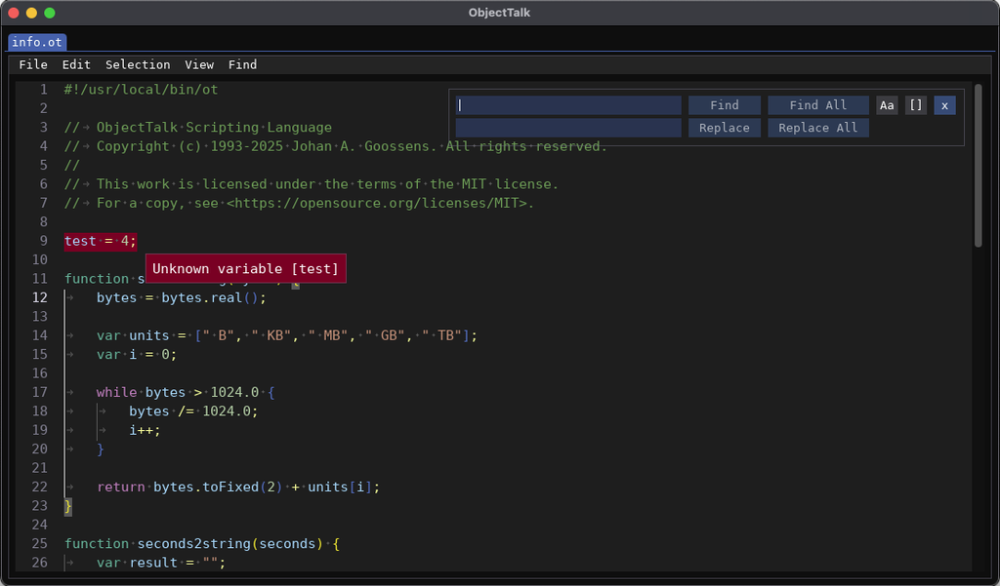
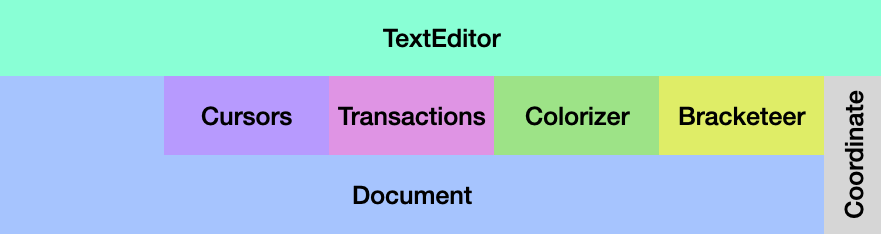
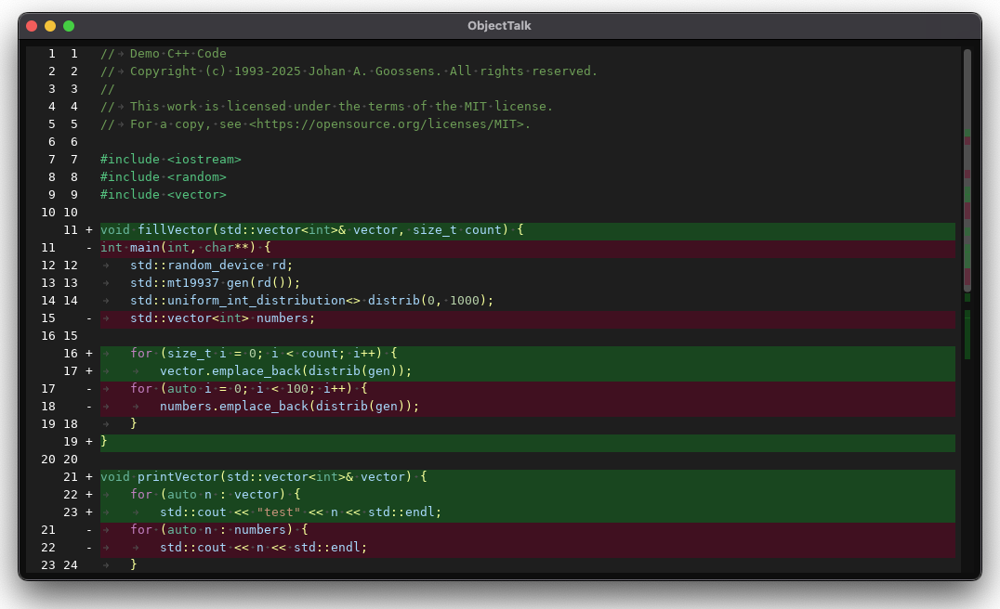
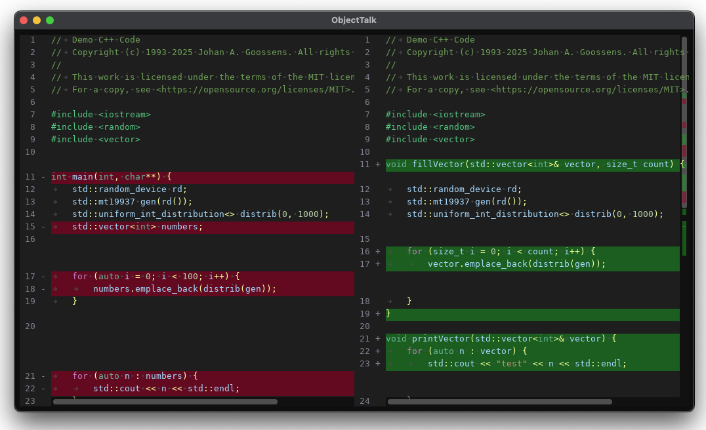

 

 

# Colorizing Text Editor and Text Diff for Dear ImGui

TextEdit is a syntax highlighting text editor for
[Dear ImGui](https://github.com/ocornut/imgui) and it was originally developed by
[Balázs Jákó](https://github.com/BalazsJako/ImGuiColorTextEdit). Unfortunately, he no
longer has time to work on the project. In fact, the last update to his repository was
in June 2019. As a result, over 200 forks exist by people who like his work but want
to fix bugs and/or add new features. A fork by
[Santiago](https://github.com/santaclose/ImGuiColorTextEdit), also known as santaclose,
was the most actively maintained version (over 220 commits ahead of the original version)
when I was looking for a syntax highlighting text editor for Dear ImGui in late 2023.
This repository was originally a fork of Santiago's version and I tried to enhance it.

In late December 2024, I decided that it was better for me to rewrite the code from
the ground up while preserving the majority of the public APIs so it would be relatively
simple for me (and others) to reuse my rewrite. One of my fundamental arguments
for the rewrite was that the code had become hard to read and maintain (at least for me).
I decided to create a more object-oriented internal architecture (see below) that made
it clear who was responsible for what by using a layered approach. While rewriting
the code, a number of new features were also added.

The rewrite and now the maintenance of this code is part of a larger project
([ObjectTalk](https://github.com/goossens/ObjectTalk)) and this repository is simply
a snapshot of the relevant editor code to provide reuse. As part of this code is
automatically generated, references to the master project are provided where required.
You can find all text editor source code components here in the
[ObjectTalk repository](https://github.com/goossens/ObjectTalk/tree/master/3rdparty/imguieditor).

To respect its origins, this repository will remain a fork (of a fork) although
there now is little code in common.

Note: In the screenshot above, the tabs and the menubar are not part of the
text editor widget. They are part of a custom enclosing IDE (which is part of
the larger [ObjectTalk](https://github.com/goossens/ObjectTalk) project).
By not putting those things in the editor, integrators have maximum
flexibility to wrap the editor in their own context in the way they see fit. The
public API to externally implement these features is however included.

## Features

- Works on MacOS, Linux and Windows.
- Has look and feel similar to Visual Studio Code.
- Works with latest Dear ImGui version (currently v1.92.1) and does not use deprecated functions.
- Supports dynamic font sizes (courtesy of Dear ImGui v1.92+). Implemented in example application.
- Supports UTF-8 encoding with 16/32 bit codepoints (based on Dear ImGui configuration, see below).
- Is C++17 based (not unreasonable in 2025 I think) although Dear ImGui still uses C++11.
- Has no runtime dependencies other than Dear ImGui and the C++17 Standard Template Library (STL).
- Has full undo/redo capabilities and supports native clipboard with UTF-8 encoded strings.
- Extendable syntax highlighting for multiple languages and API for custom languages.
- Customizable color palettes (a dark and light version that work with Dear ImGui defaults are included).
- Has find/replace user interface and API with full undo/redo.
- Find has options for whole word and/or case-sensitive searches.
- Has Marker API to specify lines and/or line numbers to highlight and optional show tooltips (see [example](docs/markers.md)).
- Has optional scrollbar minimap to render cursor, selection and marker locations.
- Provides middle-mouse pan and scroll functions like CAD programs and browsers.
- Has API to decorate each line (useful for debuggers and IDEs) (see [example](docs/lineDecorator.md)).
- Provides optional and customizable line number or text right click context menus  (see [example](docs/contextMenus.md))
- Provides auto completion for paired glyphs (\[, \{, \(, \", \') (can be turned on and off).
- If auto complete is turned on, accidentally typed closing glyphs are ignored.
- If auto complete is turned on, selections can be surrounded by paired glyphs.
- Supports blinking cursor (can be turned on/off using Dear ImGui's global io.ConfigInputTextCursorBlink flag).
- Allows bracket matching and coloring (similar to Visual Studio Code) to be turned on and off.
- Supports multiple cursors and multiple selections.
- Auto indent with simplified implementation (can be turned on and off).
- API to filter selections (with full undo support).
- Uppercase/lowercase filter is example of selection filtering.
- API to filter each line in editor (with full undo support).
- Tabs to Space (and visa versa) are examples of line filtering.
- API to strip trailing whitespaces.
- Whitespace indicators for tabs and spaces (can be turned on and off).
- No longer uses regular expressions for colorizing text (see below).
- Provides an optional companion widget to show source code differences between versions (see below).

## Integration

As explained above, the editor is developed and maintained as part of a larger project.
In that bigger project, the editor is spread out over multiple source files and some
of those are automatically generated using tools or derived from datasets (like the
unicode database). Every time the editor is updated in the bigger project, relevant
files are concatenated into a simple 2 (or 5 if you also want to use TextDiff)
file distribution which is included here.

This repository therefore provides a simple mechanism to reuse the editor in any
Dear ImGui context by doing the following:

- Include the TextEditor.cpp and TextEditor.h files in your project.
- Instantiate a TextEditor object for each editor widget you need.
- Use the public API to set editor options or interact with the editor contents.
- Call the TextEditor's Render member function every frame in your Dear ImGui loop.
- If you plan to use non-ASCII characters in your text, see the Unicode section below.
- Configure Dear ImGui's clipboard functions since that is what this editor uses.

If you also want to use the TextDiff widget, you must:

- Include TextDiff.cpp, TextDiff.h and dtl.h in your project.
- Instantiate a TextDiff object for each diff widget you need.
- Use the public API to set diff options.
- Call the TextDiff's Render member function every frame in your Dear ImGui loop.
- If you properly configured Dear ImGui for the TextEditor (see above), you are good to go.

For a complete example, please see the [example folder](example/).

## Default Keyboard and Mouse Mappings

- In the mappings listed below, the following modifier keys are used:
	- Super: this refers to the Control key on MacOS (Dear ImGui reverses Command and Control key on that platform).
	- Ctrl: this refers to the Command key on MacOS and the Control key on Linux and Windows.
	- Alt: this refers to the Option key on MacOS and the Alt key on Linux and Windows.
	- Shift: as you would expect on all platforms.
	- If a keyboard has a left and right version of these modifiers, the meaning is not different.

- Cursor Movements:
	- Single left mouse click moves the cursor.
	- Arrow keys move cursor left, right, up and down.
	- PageUp and PageDown do what you expect.
	- Ctrl-UpArrow and Ctrl-DownArrow move to the start/end of the document.
	- Home and End keys move to the start/end of the line.
	- Holding down the Shift key extends the current selection(s).
	- Holding down the Alt key with the left or right arrow moves a whole word on MacOS.
	- Holding down the Ctrl key with the left or right arrow moves a whole word on Linux and Windows.

- Panning and Scrolling:
	- The text scrolls automatically when you move the cursor through keyboard actions.
	- Mouse actions that extend the selections also apply auto scrolling.
	- The text in the editor can still be scrolled using those bars that were invented in the 1970's.
	- Devices with scroll wheels or those that simulated vertical and horizontal scroll wheels (like a touch pad, a mouse with a builtin touch pad or a pen) can also scroll the text. This is actually implemented in Dear ImGui (and used by the editor) and must be supported by your backend.
	- The middle mouse button on a three-button mouse (or whatever is reported by your OS as a middle mouse button event) enters pan or scroll mode mode depending on the configuration. Pan mode is the default and you can switch this to Scroll mode by calling SetMiddleMouseScrollMode(). Calling SetMiddleMousePanMode() switches it back. The example application uses a menu option to toggle modes.
	- In pan mode, the text is grabbed and dragged as the cursor moves and as long as the middle mouse button is down.
	- When you mouse approaches the edges of the editor window, it enters continuous panning mode and the further you move away form the window, the faster it pans.
	- Panning as described above is typical in CAD or 3D type applications.
	- In scroll mode, you can release the middle mouse button and scroll the text just like you can in some browsers.
	- Scroll mode is ended by any clicking any mouse button.
	- Panning and scrolling operate in opposite directions as they are different paradigms.
	- An optional indicator (default is on) is shown in the center of the editor window when entering pan/scroll mode. If anybody finds this annoying, it can be turned off through an API by calling SetShowPanScrollIndicatorEnabled(false).

- Cursors and Selections:
	- Alt with single left mouse click creates a new cursor on MacOS.
	- Ctrl with single left mouse click creates a new cursor on Linux and Windows.
	- Ctrl-A select all text.
	- Ctrl-D creates a new cursor and selects the next instance of the current selection.
	- Double left mouse clicks on a curly bracket select the content of the relevant block and replaces all previous cursors.
	- Shift + Double left mouse clicks on a curly bracket select the content of the relevant block including the brackets and replaces all previous cursors.
	- Double left mouse clicks not on a bracket or parenthesis, select a word. Adding Shift extends current selection.
	- Triple left mouse clicks select a line. Adding Shift extends current selection.
	- Dragging mouse with left mouse button selects text. Shift extends current selection.
	- Alt-Shift-RightArrow (on MacOS) and Ctrl-Shift-RightArrow (on Linux and Windows) grows all selections to outer blocks. First just the content of the block, than including the curly brackets. Continuously hitting the key combination keeps growing the selections.
	- Alt-Shift-LeftArrow (on MacOS) and Ctrl-Shift-LeftArrow (on Linux and Windows) shrinks all selections to inner blocks. First including the curly brackets, that just the content of the block. Continuously hitting the key combination keeps shrinking the selections.
	- Left mouse clicking or dragging over line numbers select line(s).

- Clipboard Operations:
	- Ctrl-X or Shift-Delete cuts selected text or current line if no selection.
	- Ctrl-C or Ctrl-Insert copies selected text or current line if no selection.
	- Ctrl-V or Shift-Insert pastes clipboard content.
	- Ctrl-Z undos the last action.
	- Shift-Ctrl-Z or Ctrl-Y redos the last undone action.

- Insert Text:
	- Ctrl-Enter adds line below.
	- Ctrl-Shift-Enter adds line above.

- Delete Text:
	- Backspace deletes character to the left of cursor or deletes selection(s).
	- Delete deletes character to the right of cursor or deletes selection(s).
	- Ctrl-Shift-K deletes all selected lines.

- Text Manipulation:
	- Ctrl-] indents current line or current lines.
	- Ctrl-[ de-indents current line or current lines.
	- Tab with selection indents current line or current lines.
	- Ctrl-UpArrow moves current or all selected lines up.
	- Ctrl-DownArrow moves current or all selected lines down.
	- Ctrl-/ toggles comments if language with single line comments is specified.

- Find & Replace:
	- Ctrl-f opens the find and replace window.
	- Shift-Ctrl-f finds all instances and makes them separate cursors.
	- Ctrl-g finds next instance of search text.

- Other:
	- Insert key toggles between insert (default) and overwrite modes.

## Unicode and UTF-8

This rewrite of TextEditor uses UTF-8 encoded strings for the public API
and to interact with the clipboard like the original TextEditor versions.
The original and most of its forks use UTF-8 on the private side as well
which is effective from a storage perspective but it makes all the
processing a lot harder as you constantly have to parse UTF-8 sequences.

This rewrite internally uses unicode codepoints that are either 16 or 32 bits
depending on how Dear ImGui is configured. If IMGUI_USE_WCHAR32 is defined,
Dear ImGui as well as this editor use 32 bits to store a codepoint. If it is not
defined (which is the default), 16 bits are used for each codepoint which
basically limits unicode support to the Basic Multilingual Plane (see
[this article on Wikipedia](https://en.wikipedia.org/wiki/Plane_(Unicode))).

Regardless of whether 16 or 32 bit codepoints are used, it is your responsibility
to ensure Dear ImGui is configured with the correct font and font size. As of
Dear ImGui v1.92, you can now use dynamically sized fonts and use any font glyph
without setting up glyph ranges or a font atlas. All this functionality is now
in the Dear ImGui core and the TextEditor uses it. Please see the example application
on how to use PushFont/PopFont around the TextEditor Render function. The demo app
also shows how to increase/decrease the font size on the fly.

## Architecture

While this editor relies on [Omar Cornut's Dear ImGui](https://github.com/ocornut/imgui),
it does not follow the "pure" one widget - one function approach. Since the editor
has to maintain a relatively complex and large internal state, it did not seem
to be practical to try and enforce full immediate mode. It therefore stores
its internal state in an object instance which is reused across frames. This
object is an instance of the TextEditor class which not only stores the
internal state, it also provides the public API. The "Render" member functions
however works like a normal Dear ImGui widget. It creates a child window to
render the editor so you can call Dear ImGui window functions like SetNextWindowSize
or set the font before calling Render.

The block diagram below shows the architecture of this widget. At the top is
the public facing TextEditor instance and at the bottom are the private classes
that store and maintain the internal state.

#### Document

This class, as the name suggests, stores the document that's being edited.
Internally, a Document is a std::vector of Lines that themselves are
std::vectors of Glyphs.

The Document class translates from the external UTF-8 encoding to the internal
codepoints and provides a number of member functions to manipulate contents,
calculate coordinates, assist searches and track overall content state.

The Line and Glyph classes are used to represent the document's structure with
Glyph just holding a codepoint and a color.

#### Cursors

The Cursors class maintains a list of Cursor instances and operates very much
like cursors do in Visual Studio Code. The list of cursors consists of the
main cursor (which is always present) and a optional set of additional cursors.
The last cursor added is considered the current cursor which has meaning for
some actions or API calls.

#### Transactions

This class contains a list of Transaction records to support do/undo/redo
operations. Each Transaction record contains insert and delete operations
performed on a document.

#### Colorizer

The colorizer maintains the color state of each glyph based on the rules
provided by the specifications in the Language object. The original version
used regular expressions for some languages but this was/is not very
performant. The new colorizer is based on multiple state-transition engines
that make it easier to express language rules and also improves performance.
The new colorizer only effects lines that have changed but keep in mind, that
for instance opening a multiline comment at the start of the document,
causes the entire document to be re-colorized. Luckily the new engine is fast
enough that you don't notice this and it would only affect a single frame. I
think it is also important to point out that this widget is not really intended
for mega/gigabyte size text files. For those, I would still use a regular text
editors.

#### Bracketeer

This class keeps track of where bracket pairs (parenthesis, square brackets and
curly brackets) are in the document so they can be highlighted and colorized
when this feature is activated. It will also colorize unbalanced brackets as
errors. Brackets in comments and strings are ignored.

#### Coordinate

Coordinates represent a character coordinate from the user's point of view,
i. e. consider an uniform grid on the screen as it is rendered, and each cell
has its own coordinate, starting from Tabs are counted as [1..tabsize]
spaces, depending on how many spaces are necessary to reach the next tab stop.
For example, coordinate (1, 5) represents the character 'B' in a line "\tABC",
when tabsize = 4, because it is rendered as "&nbsp;&nbsp;&nbsp;&nbsp;ABC" on the screen.

#### TextEditor

As mentioned above, the TextEditor class provides the public API. As is true
for all Dear InGui and the original text editor, all public member functions start
with an uppercase letter. Internally, all private member functions and variables
start with a lowercase letter so it's easy to see what's public and what's private.

In addition to being the public interface, the TextEditor class is also responsible
for synchronizing the state of the lower levels of the architecture. When for
instance the user pastes some text, TextEditor ensures that the Document gets
updated, Cursors get adjusted (if required), Transaction records are created (so
this paste operation can be undone and redone) and the Colorizer/Bracketeer are
informed of the changes.

The final responsibility of the TextEditor class is rendering and user input
(keyboard and mouse) processing.

#### TextDiff

TextDiff is a separate widget that is derived from TextEditor which allows
you to show the differences between two versions of some code while preserving color
highlighting. The code for this widget is in separate files (see integration above)
so it is optional. TextDiff is readonly and has two modes:

- **Integrated view** where differences are depicted vertically using the standard "diff" look and feel. This view is implemented as a read-only TextEditor with markings and a line decorator which means that functions like text select and copy are available. This is the default view.

- **Side-by-side view** where the original and altered versions are shown/compared side-by-side. This a a custom static view that does not have the usual TextEditor features like text select or copy. Scrolling however is available.

In both modes, the provided text can be colored based on a specified language and
color palette like in the TextEditor. The background colors for the difference
highlighting are not part of the palette but can still be changed through a the public API.

Below are two screenshots of its use in both modes. Have a look at the code in the [example application](example/) to see how easy it is to use this TextDiff widget.

## Issues

If you are interested in using this Text Editor, steal parts of the code, make
suggestions for improvements or contribute fixes/enhancements, be my guest as this
repository is released under the MIT license. For people that want to contribute,
[Contributing Guidelines](CONTRIBUTING.md) and a [Code of Conduct](CODE_OF_CONDUCT.md)
are available. If you find any problems or want to make a suggestion for improvement, please
[raise an issue on this repository](https://github.com/goossens/ImGuiColorTextEdit/issues).

## Credits

Thank you [Omar Cornut](https://github.com/ocornut/imgui) for creating Dear ImGui
in the first place. Without you, this editor would not exist.

I owe a great deal of gratitude to [Balázs Jákó](https://github.com/BalazsJako/ImGuiColorTextEdit)
who started this editor many years ago.

I also have to thank [Santiago (santaclose)](https://github.com/santaclose/ImGuiColorTextEdit)
for reviving this project, merging the unfinished developments and pull requests.
He was also responsible for adding features to the editor like multiple cursors.

Given that neither Balázs nor Santiago kept a credits list, it is highly likely
that many others have also made contributions. Theoretically I could go through
all the issues on the original and the fork but I think I have better use for my
time. If you believe you deserve credit here, please raise an issue with reference
to your work. I'll gladly add it.

For the Text Diff widget, credit goes to [Tatsuhiko Kubo (cubicdaiya)](https://github.com/cubicdaiya)
for his [Diff Template Library (DTL)](https://github.com/cubicdaiya/dtl) which is
released under the BSD License.

## License

This work is licensed under the terms of the MIT license.
For a copy, see <https://opensource.org/licenses/MIT>.

The included DTL library (which is only used in the Diff Widget) is released under the
[BSD license](https://github.com/cubicdaiya/dtl/blob/master/COPYING).
