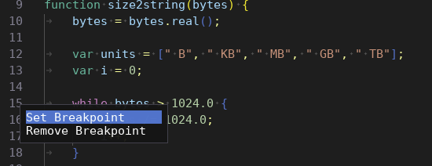

# Context Menus

The text editor provides an option to create context menus when the user right clicks on a line number or anywhere in the text. The editor creates these menus and a provided callback needs to populate them.

In the example below, the line number context menu is used to control breakpoints and the text context menu is used to report the current position in the text. Only the first is depicted in the screenshot.

```c++
editor.SetLineNumberContextMenuCallback([](int line) {
	if (ImGui::MenuItem("Set Breakpoint")) { /* handle click */ }
	if (ImGui::MenuItem("Remove Breakpoint")) { /* handle click */ }
});

editor.SetTextContextMenuCallback([](int line, int column) {
	ImGui::Text("Line %d, column %d", line + 1, column + 1);
});
```


