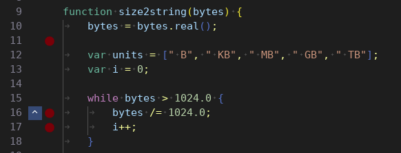

# Line Decorator Example

The text editor provides an option to add a line decorator. This decorator gets called for each visible line and the integrator can render whatever they want in the requested space and can also handle user inputs the usual Dear ImGui way.

Below is an example where a 41 pixel wide column is requested for custom decorations and the provided callback renders a regular ImGui Button and also draws a custom button with a red circle. The first button has a tooltip and the second button responds to a right-click with a popup to demonstrate some of the possibilities.

When the line decorator is called, the ImGui position is already set (so you can render ImGui widgets immediately) and a new ID scope is established (to avoid ID collisions between lines). If you push style changes, make sure you also pop them before leaving the callback.

If you don't want to express the decorator width in pixels, you can pass a negative number which is interpreted as the width of a specified number of glyphs.

```c++
editor.SetLineDecorator(41.0f, [](TextEditor::Decorator& decorator) {
	if (decorator.line == 10 || decorator.line == 15|| decorator.line == 16) {
		auto size = decorator.height - 1.0f;

		if (decorator.line == 15) {
			if (ImGui::Button("^", ImVec2(size, size))) {
				// performing useless action
			}

			if (ImGui::IsItemHovered()) {
				ImGui::SetTooltip("Perform useless action");
			}

		} else {
			ImGui::Dummy(ImVec2(size, size));
		}

		ImGui::SameLine(0.0f, 1.0f);

		auto pos = ImGui::GetCursorScreenPos();
		auto drawlist = ImGui::GetWindowDrawList();

		drawlist->AddCircleFilled(
			ImVec2(pos.x + size * 0.5f, pos.y + size * 0.5f),
			(size - 6.0f) * 0.5f,
			IM_COL32(128, 0, 0, 255));

		ImGui::InvisibleButton("Invisible", ImVec2(size, size));

		if (ImGui::BeginPopupContextItem()) {
			if (ImGui::MenuItem("Call Something")) { /* handle click */ }
			if (ImGui::MenuItem("Call Something Else")) { /* handle click */ }
			ImGui::EndPopup();
		}
	}
});
```


