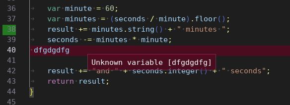

# Markers

The text editor provides an option to add markers to individual line numbers and/or the text on those lines. Markers can have individual colors and can optionally have tooltips to explain the purpose of the marker.

In the example below, a red marker is used to highlight an error and the tooltip is used for a more detailed error message. A second green marker is used to highlight a line number which could symbolize a breakpoint. Provided line numbers must be zero-based.

Markers are rendered after selected text is highlighted so if you want to see both, please use a transparent color for the marker.

Markers are associated with the specified lines so when lines are inserted or deleted above, the marker will move as well. When the marked line is deleted or all markers are removed via the API, the mark disappears.

```c++
editor.AddMarker(ErrorlineNumber, 0, IM_COL32(128, 0, 32, 128), "", errorMessage);
editor.AddMarker(breakPointLineNumber, IM_COL32(0, 255, 32, 100), 0, "", "");
```


