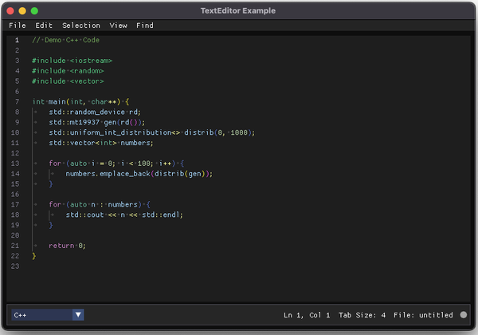

# TextEditor Example

This directory contains a full example on how to use the TextEditor widget.
It implements a poor man's editor complete with menubar, statusbar,
file selectors and status tracking.

It uses the SDL3 GPU rendering backend and comes with CMake support so
you should be able to run it on MacOS, Linux and Windows. Here are
the instructions on how to get started based on platform and
development tools.

## Visual Studio Code

- This should work on MacOS (tested), Linux (untested) and Windows (untested).
- Ensure you have the C++ and CMake extensions activated in your installation.
- Open the top-level ImGuiColorTextEdit folder.
- As the top-level does not contain a CMakeList.txt file, tell Visual Studio Code you want to use the example/CMakeList.txt file.
- When you build the executable, the dependencies (SDL3, Dear ImGui and ImGuiFileDialog) will be automatically downloaded.

## Xcode

- You can generate the Xcode project file from the command line:
	- Install **homebrew** using the instructions at [https://brew.sh](https://brew.sh).
	- Install git using **brew install git** from the command line.
	- Install Cmake using **brew install cmake** from the command line.
	- Run the following in the **examples** folder: **cmake -B ../build -G Xcode**.
	- You now have an Xcode project in the top-level **build** folder.
	- This step is only required once.

## Visual Studio

- Visual Studio has CMake integration so you should be able to do it in a similar way to Visual Studio Code.

## Command line

- MacOS:
	- Installing **homebrew** using the instructions at [https://brew.sh](https://brew.sh).
	- Installing git using **brew install git** from the command line.
	- Installing Cmake using **brew install cmake** from the command line.
	- Install Ninja using **brew install ninja** from the command line.

- Linux:
	- Ensure the **build-essential**, **cmake** and **ninja-build** packages are installed.

- All platforms
	- Run the following commands:
		- **cd example**
		- **cmake -B ../build -G "Ninja Multi-Config"**
		- **cmake --build ../build --config Debug**
	- The executable should now be at **ImGuiColorTextEdit/build/Debug/example**
