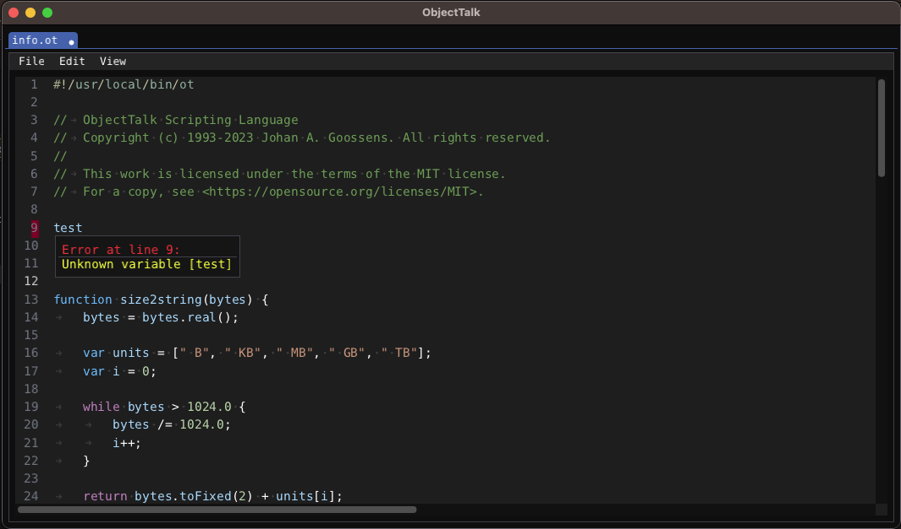

# About this fork

ImGuiTextEdit was originally developed by [Balázs Jákó](https://github.com/BalazsJako/ImGuiColorTextEdit) but he apparently has no
time at the moment to work the project. In fact, the last update to his repository was in June 2019. As a result, over 200 forks
exist by people who like his work but want to fix bugs and/or add new features.

A recent fork by [Santiago](https://github.com/santaclose/ImGuiColorTextEdit), also known as santaclose, is currently the most
actively maintained version and this repository is a fork of it. Following is a list of difference between this fork and the
one by Santiago:

- Ability to specify custom syntax highlighting for other languages is restored.
- Ability to have custom palettes is restored.
- Ability to have error markers is restored.
- Ability to choose (at compile time) between boost::regex and std::regex (the latter makes this repository dependency free)
- Auto complete for paired glyphs (\[, \{, \(, \", \') (can be turned on and off).
- Support blinking cursor (can be turned on/off using ImGui's global io.ConfigInputTextCursorBlink flag).
- Allow bracked matching to be turned on and off.
- Improve keyboard shortcuts on MacOS

Within reason, all efforts are made to stay in sync with Santiago's fork.

## License

This work is licensed under the terms of the MIT license.
For a copy, see <https://opensource.org/licenses/MIT>.
